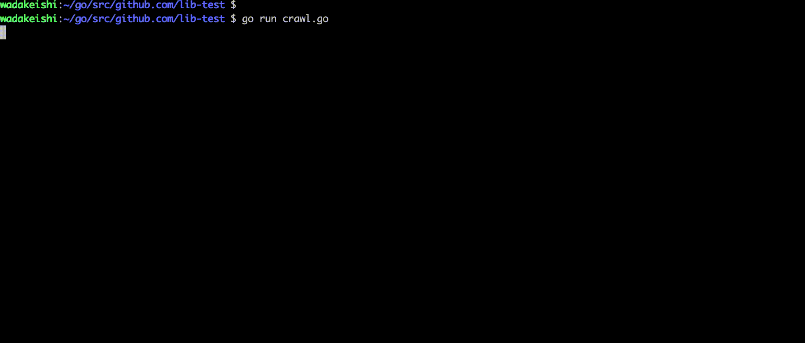

# easy-crawl

[](https://godoc.org/github.com/kcwebapply/easy-crawl)
[](https://goreportcard.com/report/github.com/kcwebapply/easy-crawl)
[](https://travis-ci.org/kcwebapply/easy-crawl)


easy-crawl is library for crawling smoothly and set callback method easily.

## Installation

To install easy-crawl package, you need to install Go and set your Go workspace first.

1. Download and install it:

```sh
$ go get -u github.com/kcwebapply/easy-crawl
```

2. Import it in your code:

```go
import "github.com/kcwebapply/easy-crawl"
```


## Usage
### crawling
```Go
func main() {

  // initialize Easycrawler{} with crawling depth.
  crawler := easyCrawl.EasyCrawler{Depth: 3}


  // you should implements CallBackInterface and set it in SetCallBack() method.
  crawler.SetCallBack(CallBackImpl{})


  // you can monitor how crawling is being done by call SetLogging() and set `true`.
  crawler.SetLogging(true)

  // crawling!
  crawler.Crawl("http://spring-boot-reference.jp/")
}


```

### callback interface
you should implements __CallBackInterface__ to set callback method.
- `url` is content's base-url
- `urls` is list of url in html body (extracted from `href` tag).
- `body` is html body of content
```Go
type CallBackInterface interface {
	Callback(url string, urls []string, body string)
}
```

Here is the example of implementing of __CallBackInterface__
```Go
type CallBackImpl struct {
}

func (callbackImpl CallBackImpl) Callback(url string, urls []string, body string) {
   // implements as you like .
}
```

## Demo
you can try crawling running this go file.
```
go run example/crawl.go
```



